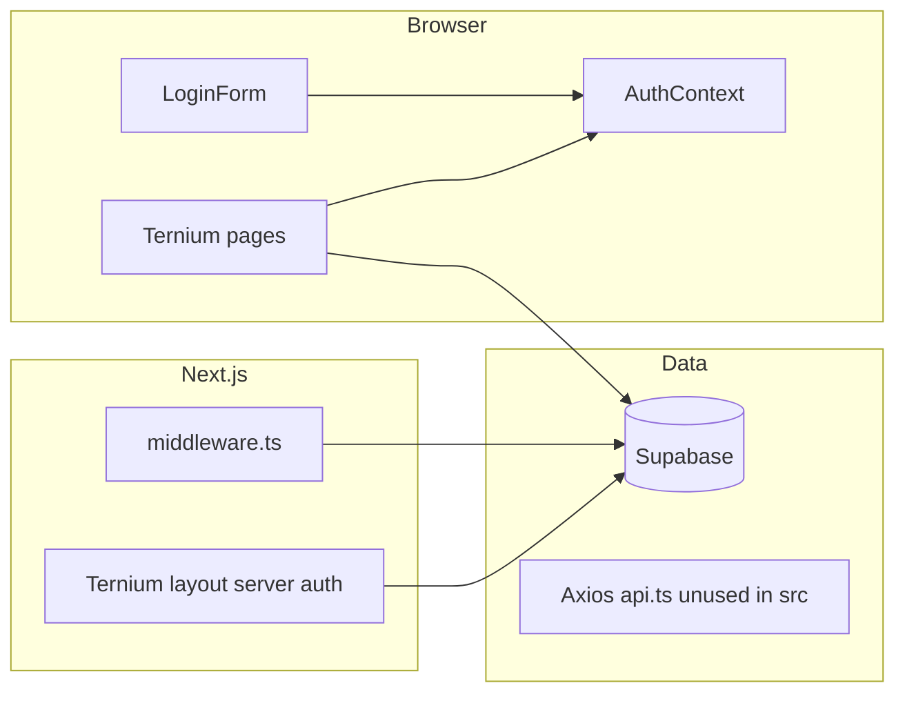

# Ternium Front — Repository Overview

This document describes the **Ternium Front** codebase: what it does, how it is structured, which technologies it uses, and how authentication, authorization, and data access fit together. The project name in `package.json` is `ternium_front`; the root `README.md` title is “Ternurin” (likely a short internal name).

---

## 1. Purpose and domain

**Ternium Front** is a **web portal for managing steel-order workflows** (orders, programming, plant execution, dispatch validation, shipping, and user administration). The UI is built around **role-based access**: different personas see different sidebar sections and dashboards tailored to their responsibilities.

Typical flow implied by the schema and UI:

1. **Orders** are created and reviewed (`gestión`, client revisions, contra-offers).
2. **Programming** assigns dates and workers (`programing_instructions`).
3. **Operations** track **execution** on the shop floor (`execution_details`).
4. **Order management / dispatch validation** approves orders for outbound logistics (`dispatch_validation`).
5. **Shipping** tracks delivery state (`shipping_info`).
6. **Leaderboard** aggregates metrics for workers and managers.
7. **User admin** manages accounts and roles; **client managers** see orders scoped to their clients.

The app is **Spanish-first** in copy (labels, toasts, dashboard strings) while code identifiers and many types follow English naming.

---

## 2. Technology stack

| Layer | Choice |
|--------|--------|
| Framework | **Next.js** `16.1.6` (App Router) |
| UI library | **React** `19.2.3` |
| Language | **TypeScript** `5.x` (strict mode) |
| Styling | **Tailwind CSS** `4` with PostCSS |
| Backend-as-a-service | **Supabase** (`@supabase/supabase-js`, `@supabase/ssr`, legacy `@supabase/auth-helpers-nextjs` in dependencies) |
| HTTP client (optional / future) | **Axios** — `src/lib/api.ts` defines a client; **no current imports** of that module elsewhere in `src` (data paths use Supabase directly) |
| Maps | **Leaflet** + **react-leaflet** (despacho map; client-only dynamic import) |
| 3D | **three**, **@react-three/fiber**, **@react-three/drei** (Tarima / pallet visualization) |
| Notifications | **react-hot-toast** |
| Icons | **react-icons** |
| Lint | **ESLint** `9` with **eslint-config-next** |

Path alias: `@/*` → `./src/*` (`tsconfig.json`).

---

## 3. Repository layout (high level)

```
Ternium_Front/
├── agents/
│   └── CODING_STANDARDS.md      # Team naming / language conventions (see §12)
├── public/                      # Static assets (SVGs, etc.)
├── src/
│   ├── app/                     # Next.js App Router: pages, layouts, loading UI
│   │   ├── layout.tsx           # Root: fonts, AuthProvider, globals
│   │   ├── page.tsx             # Redirects "/" → /login
│   │   ├── globals.css
│   │   ├── login/
│   │   └── ternium/             # Authenticated app shell (sidebar layout)
│   ├── components/              # Reusable UI (by feature or shared)
│   ├── context/                 # React context (auth, sidebar)
│   ├── hooks/                   # Data and behavior hooks (by domain)
│   ├── lib/                     # Supabase clients, permissions, API, tarima logic
│   ├── middleware.ts            # Supabase session refresh on requests
│   └── types/                   # App types + generated DB types
├── eslint.config.mjs
├── next.config.ts
├── package.json
├── postcss.config.mjs
├── tsconfig.json
├── package-lock.json
└── pnpm-lock.yaml               # Both npm and pnpm lockfiles present
```

---

## 4. Environment variables

The app expects Supabase configuration (see `src/lib/supabase/*.ts`):

- **`NEXT_PUBLIC_SUPABASE_URL`** — Supabase project URL  
- **`NEXT_PUBLIC_SUPABASE_PUBLISHABLE_KEY`** — anon/public key (the code variable name uses “PUBLISHABLE” rather than “ANON”)

Optional for a separate REST backend (`src/lib/api.ts`):

- **`NEXT_PUBLIC_PRODUCTION_API`** — used when `NODE_ENV === 'production'` as Axios `baseURL`  
- Development default for API: `http://localhost:4000` (only relevant if you start using `api` in code)

---

## 5. Authentication and session handling

### 5.1 User-facing login

- **Route:** `/login` (`src/app/login/page.tsx`)  
- **Server:** If a session already exists, **redirect** to `/ternium/dashboard`.  
- **Client form:** `LoginForm` uses `supabase.auth.signInWithPassword` and navigates to `/ternium/dashboard` on success.

### 5.2 Root vs Ternium layout

- **Root layout** (`src/app/layout.tsx`): wraps the tree with **`AuthProvider`**, loads **Inter** and **IBM Plex Mono**, applies global CSS.  
- **Ternium layout** (`src/app/ternium/layout.tsx`): **server-side** `createClient()` from `@/lib/supabase/server`, calls `getUser()`, and **redirects to `/login`** if unauthenticated. It also renders **Sidebar**, **Toaster**, skip link, and **`SidebarProvider`**.  
- **`export const dynamic = 'force-dynamic'`** on the Ternium layout ensures server rendering respects auth on each request.

### 5.3 Middleware

`src/middleware.ts` runs Supabase’s SSR helper (`src/lib/supabase/middleware.ts`) on almost all routes so **auth cookies stay fresh**. Matcher excludes `_next/static`, `_next/image`, and `favicon.ico`.

### 5.4 Client-side user + role

`AuthContext` (`src/context/AuthContext.tsx`):

- Subscribes to `onAuthStateChange` for `INITIAL_SESSION` / `SIGNED_IN`.  
- Loads **`users.role_id`** from Supabase then **`roles.name`** into **`user.role_name`**.  
- Exposes `{ user, loading }` via **`useUser()`**.

This keeps the **sidebar** and **client guards** in sync with the database role name.

---

## 6. Authorization (RBAC)

### 6.1 Canonical map: `ROLE_ALLOWED_PATHS`

Defined in `src/lib/permissions.ts`:

| Role (`roles.name`) | Allowed path prefixes |
|---------------------|------------------------|
| `user_admin` | `/ternium/dashboard`, `/ternium/usuarios`, `/ternium/leaderboard` |
| `client_manager` | `/ternium/dashboard`, `/ternium/clientes`, `/ternium/leaderboard` |
| `order_manager` | `/ternium/dashboard`, `/ternium/gestion`, `/ternium/leaderboard` |
| `operations_manager` | `/ternium/dashboard`, `/ternium/operaciones`, `/ternium/leaderboard` |
| `scheduler` | `/ternium/dashboard`, `/ternium/programacion`, `/ternium/leaderboard` |
| `order_controller` | `/ternium/dashboard`, `/ternium/management`, `/ternium/leaderboard` |

**Special case:** `role_name === 'admin'` → **`isAllowed` returns true** for every path (full access).

Matching is **prefix-based**: `/ternium/gestion/orden/123` is allowed if `/ternium/gestion` is allowed.

### 6.2 Where enforcement happens

1. **Sidebar** (`src/components/Sidebar.tsx`): menu items are filtered with `isAllowed(user?.role_name, item.path)` so users only **see** routes they may use.  
2. **`useRoleGuard(protectedPath)`** (`src/hooks/useRoleGuard.ts`): client hook that **redirects to `/ternium/dashboard`** if the user is not allowed for `protectedPath` (after loading completes).

**Important:** **`/ternium/despacho` is not listed** in `ROLE_ALLOWED_PATHS`. Only users with role **`admin`** pass `isAllowed` for that path. The Despacho pages call `useRoleGuard('/ternium/despacho')`, so non-admin roles are bounced to the dashboard. The sidebar still **shows** “Despacho” for admins only (same rule). If logistics users should access Despacho, **`ROLE_ALLOWED_PATHS` and any guards must be updated** accordingly.

---

## 7. Data model (Supabase)

Generated types live in **`src/types/database.ts`** (regenerated via `npm run gen:types`, which targets a specific Supabase project id in `package.json`).

### 7.1 Core tables (conceptual)

- **`users`** — extends auth users with `name`, `second_name`, `email`, `role_id`, `active`, etc.  
- **`roles`** — `id`, `name` (strings such as `order_manager`, `admin`, …).  
- **`clients`** — client companies.  
- **`client_workers`** — many-to-many **user ↔ client** for client managers.  
- **`product`** — products (`pt`, `master`, `client_id`).  
- **`specs`** / **`order_offers_specs`** — coil dimensions, weights, orientation, packaging, etc.  
- **`orders`** — central entity: `status`, `client_id`, `product_id`, `specs_id`, `worker_id`, links to `programing_instructions_id`, `execution_details_id`, `dispatch_validation_id`, `shipping_info_id`, `contra_offer`, `reviewed_by`, etc.  
- **`programing_instructions`** — scheduling: `status`, `assigned_date`, `responsible`, notes.  
- **`execution_details`** — plant execution: `status`, `weight`, `shipping_packaging`, `note`, `recorded_by`.  
- **`dispatch_validation`** — gate before dispatch: `status`, `approved_at`, `approved_by`.  
- **`shipping_info`** — logistics: `status`, plates, tar, dates, etc.  
- **`order_offers`** — contra-offer linkage to alternate specs.  
- **`leaderboard_snapshots`** — persisted leaderboard metrics (optional vs live queries).  
- **`user_activity_log`** — audit-style log: `action_type`, `entity_type`, `entity_id`, `metadata`.

### 7.2 Enums (from generated types)

- **`order-status-enum`:** `Aceptado`, `Rechazado`, `Revision Cliente`, `Revision Operador`  
- **`programing-status-enum`:** `Asignado`, `Sin asignar`, `Reasignado`  
- **`execution_details_enum`:** `Aceptado`, `Rechazado`, `Pendiente`  
- **`dispatch_enum_status`:** `Aceptado`, `Pendiente`, `Rechazado`  
- **`shipping_info_status`:** `En ruta`, `Pendiente`, `Rechazado`, `Entregado`

Domain-specific TypeScript types under `src/types/` (e.g. `orders.ts`, `despacho.ts`, `programacion.ts`) complement the generated `Database` type for UI layers.

---

## 8. Application routes (App Router)

| Route | Role guard (typical) | Notes |
|-------|----------------------|--------|
| `/` | — | Redirects to `/login` |
| `/login` | — | Logged-in users → `/ternium/dashboard` |
| `/ternium` | (layout) | Must be logged in; shell with sidebar |
| `/ternium/dashboard` | `useRoleGuard('/ternium/dashboard')` | Role-aware KPIs and quick actions (`useDashboardData`) |
| `/ternium/leaderboard` | `useRoleGuard('/ternium/leaderboard')` | Rankings / metrics |
| `/ternium/usuarios` | usuarios | User list and filters |
| `/ternium/usuarios/crearusuario` | — | Create user flow (nested under usuarios) |
| `/ternium/clientes` | clientes | Client-scoped orders |
| `/ternium/clientes/orden/[slug]` | — | Order detail for client managers |
| `/ternium/gestion` | gestión | Order management (order_manager) |
| `/ternium/gestion/crearpedido` | — | Create order |
| `/ternium/gestion/orden/[slug]` | — | Order detail |
| `/ternium/programacion` | programación | Scheduler views |
| `/ternium/programacion/editar/[slug]` | — | Edit programming for an order |
| `/ternium/operaciones` | operaciones | Operations / execution |
| `/ternium/operaciones/orden/[slug]` | — | Operation order detail |
| `/ternium/management` | management | Dispatch validation (order_controller) |
| `/ternium/management/orden/[slug]` | — | Management order detail |
| `/ternium/despacho` | `useRoleGuard('/ternium/despacho')` | Shipping list; **admin-only** with current permissions |
| `/ternium/despacho/orden/[slug]` | — | Despacho order view (map, etc.) |
| `/ternium/despacho/gestionar/[slug]` | — | Manage dispatch steps for an order |

Each major section often has a **`loading.tsx`** sibling for streaming/suspense-style loading UI.

---

## 9. Feature areas (detailed)

### 9.1 Dashboard (`/ternium/dashboard`)

- **`useDashboardData`** is a large, role-branching hook that queries Supabase counts and recent rows per role (`order_manager`, `scheduler`, `operations_manager`, `order_controller`, `client_manager`, `user_admin`, `admin`).  
- KPIs, alerts, quick actions, and recent orders change by role.  
- **`roleModuleMap`** in the dashboard page links each role to its primary module for “recent orders” navigation.

### 9.2 Gestión de órdenes (`/ternium/gestion`)

Hooks such as `useOrders`, `useOrderById`, UI for listing, creating (`crearpedido`), accepting/rejecting (`AcceptOrderButton`), and Tarima-related specs for packaging. Tied to **`orders`**, **`specs`**, products, and status workflow.

### 9.3 Programación (`/ternium/programacion`)

Uses `useProgrammingData` and types in `src/types/programacion.ts`. Focus: `programing_instructions` (assignments, dates, responsible worker, statuses like `Sin asignar` / `Reasignado`).

### 9.4 Operaciones (`/ternium/operaciones`)

`useOperacionesOrders`, `useOperacionDetail`, `execution_details` statuses, validation of plant execution.

### 9.5 Management (`/ternium/management`)

`useManagementOrders`, `useManagementDetail`. Works with **`dispatch_validation`** (approve/reject dispatch). Success toasts reference approving for dispatch. Dashboard for `order_controller` surfaces pending dispatch validations.

### 9.6 Despacho (`/ternium/despacho`)

- **`useDespachoOrders`**: filters **`shipping_info`** by status, then loads **`orders`** with related product, client, dispatch_validation, shipping_info; pagination.  
- **`useDespachoDetail`**: single-order dispatch workflow; map on detail pages.  
- **`DespachoMap`**: Leaflet map centered on **Monterrey**, OSM tiles; **dynamic import with `ssr: false`** to avoid SSR issues with Leaflet.

### 9.7 Clientes (`/ternium/clientes`)

Scoped via **`client_workers`** to the logged-in user’s `client_id` list; order lists and detail routes under `clientes/orden/[slug]`.

### 9.8 Usuarios (`/ternium/usuarios`)

`useUsuarioData`, `UsuariosTable`, `UsuariosFilters`. **Create user** at `crearusuario` with `useCreateUsuarioForm`, `useRolesAndClients`, sections in `components/crearusuario/`.

### 9.9 Leaderboard (`/ternium/leaderboard`)

`useLeaderboardData`: builds two leaderboards (e.g. **trabajadores** vs **gestores**) from Supabase with period filters (`week` / `month` / `all`), scoring helpers in the hook file.

### 9.10 Tarima (pallet / coil visualization)

Located under **`src/lib/tarima/`** and **`src/components/tarima/`**:

- **`simulation.ts`**: pure functions computing **coil placements** in mm (vertical vs horizontal orientation) with constants from `constants.ts`.  
- **`types.ts`**, **`validations.ts`**: spec types and validation rules.  
- **`useTarimaSimulation`**: bridges UI state to simulation.  
- **Three.js** components: `TarimaScene`, `TarimaViewer`, `TarimaPanel`, `TarimaCoilVertical`, `TarimaCoilHorizontal`, `TarimaComparisonPanel`, `TarimaRiskBadge`, loading fallbacks.

Used to visualize whether coil stacks fit pallet constraints for shipping.

---

## 10. Shared UI and UX patterns

- **Loading:** `LoadingSpinner` and route-level `loading.tsx` files.  
- **Status display:** `StatusBadge`, `StatusPill`.  
- **Layout:** Full-height shell, gradient page backgrounds (`slate` / blue tones), cards with borders and soft shadows — consistent across dashboard, despacho, etc.  
- **Sidebar:** Dark theme (`#0f0d0d`), red accent (`#e05252`) for active item; collapse toggle via `SidebarContext`.  
- **Accessibility:** Skip link “Ir al contenido principal” in Ternium layout; `aria-*` on sidebar controls.  
- **Toasts:** `react-hot-toast` styled in Ternium layout (light background, slate border).

---

## 11. Scripts (`package.json`)

| Script | Purpose |
|--------|---------|
| `dev` | `next dev` |
| `build` | `next build` |
| `start` | `next start` |
| `lint` | `eslint` |
| `gen:types` | Generates Supabase TypeScript types into `src/types/database.ts` (requires Supabase CLI / network; project id embedded in script) |

---

## 12. Team conventions (`agents/CODING_STANDARDS.md`)

The repo includes an **agents** folder with **coding standards**: PascalCase vs camelCase, boolean prefixes (`is`/`has`/`can`/`should`), verb-led function names, and a stated preference for **English** in code and identifiers. **Note:** Much of the **UI copy** in this codebase is **Spanish**, which is normal for product text; the standard document targets identifiers and comments.

---

## 13. HTTP API client (`src/lib/api.ts`)

Axios is configured with:

- **Production:** `NEXT_PUBLIC_PRODUCTION_API`  
- **Development:** `http://localhost:4000`  
- **`withCredentials: true`** for cookie-based sessions if the backend expects them  

No imports of this module appear under `src` at the time of writing — **all data access observed uses Supabase**. The Axios instance is likely **prepared for a future or parallel Java backend** (the `localhost:4000` default suggests a local API).

---

## 14. Operational notes and dependencies

- **Lockfiles:** Both **`package-lock.json`** and **`pnpm-lock.yaml`** exist; pick one package manager for installs to avoid drift.  
- **Supabase types:** Regenerating types (`gen:types`) overwrites `src/types/database.ts` — commit carefully and align with production schema.  
- **Security:** Authorization is **enforced in the UI** via `isAllowed` / `useRoleGuard`. **Row-level security and policies in Supabase** should still be the source of truth for data protection; the frontend must not be the only gate.  
- **Despacho access:** As discussed, only **`admin`** fits the current `ROLE_ALLOWED_PATHS` for `/ternium/despacho`; confirm whether a dedicated role (e.g. logistics) should be added.

---

## 15. Quick mental model



This repository is a **Next.js 16 + React 19** SPA-style app (with RSC/server layouts) focused on **Supabase-backed order lifecycle management**, **role-based UI**, **3D tarima visualization**, and **optional maps** for logistics — with an **Axios client ready** for a REST API when needed.
